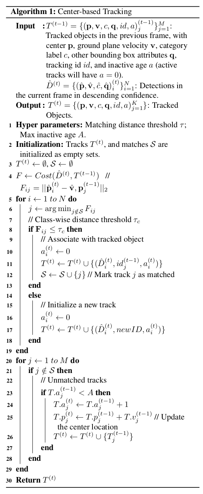
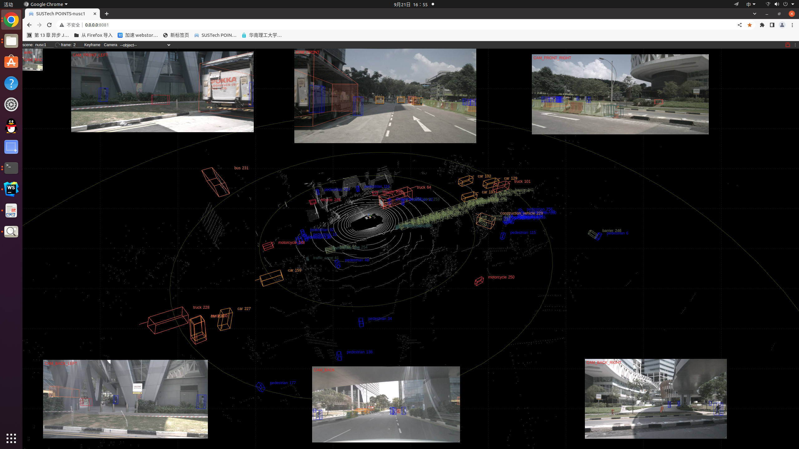
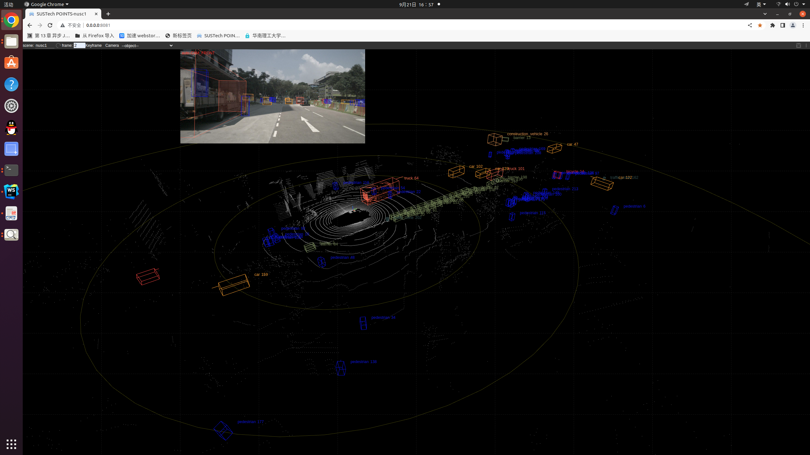
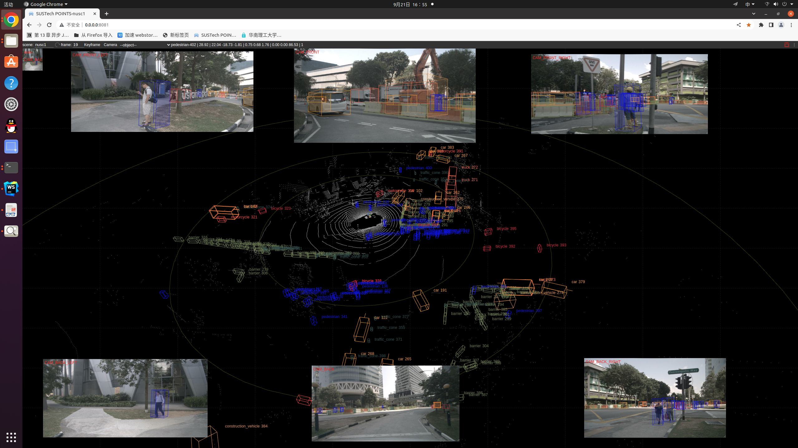
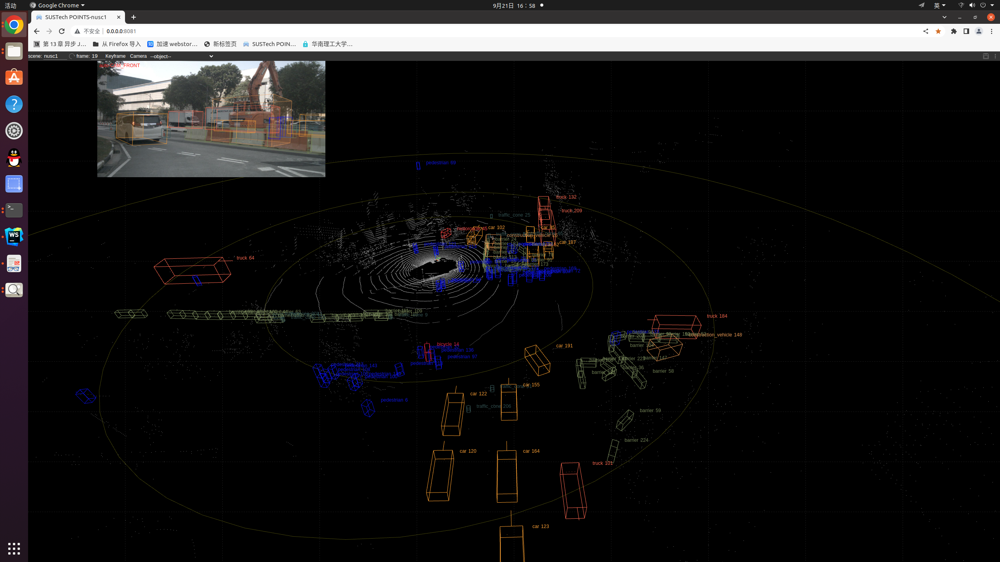
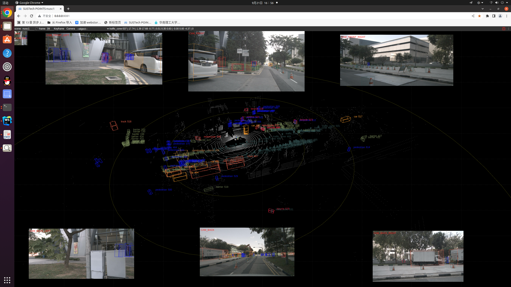
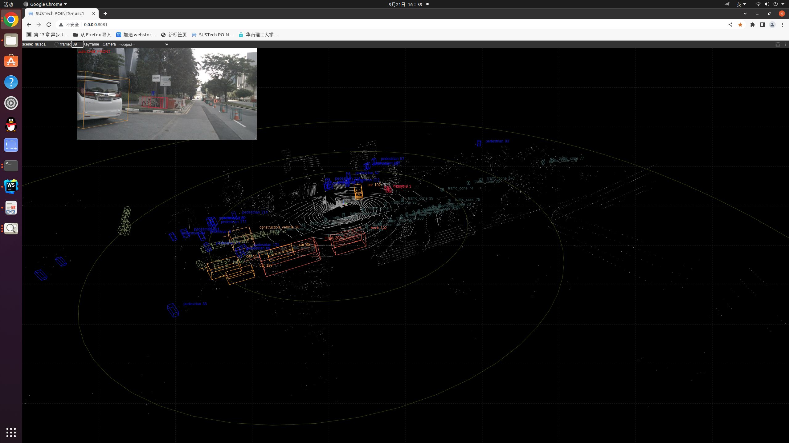

# 人机协同跟踪算法
Yin T, Zhou X, Krahenbuhl P. Center-based 3d object detection and tracking[C].Proceedings of the IEEE/CVF conference on computer vision and pattern recognition(CVPR). 2021: 11784-11793.

改进点：

1. 已经人为确定的标注框替代算法的检测结果，包括预先保存好的以及实时保存的
2. 已经人为确定的物体，那么其他帧中该物体的大小参数应该一致，不再使用检测的结果
3. 生成了初始的跟踪结果后，人为地对标注框进行增删改都会改变标注框（包括改变分类，大小，位置，速度等），那么后续跟踪就会
使用更新后的这个标注框

方法：算法实现写在python搭建的server端，前端部分卸载js搭建的client端，实时更新的结果不断传给server，获取跟踪结果

结果：

